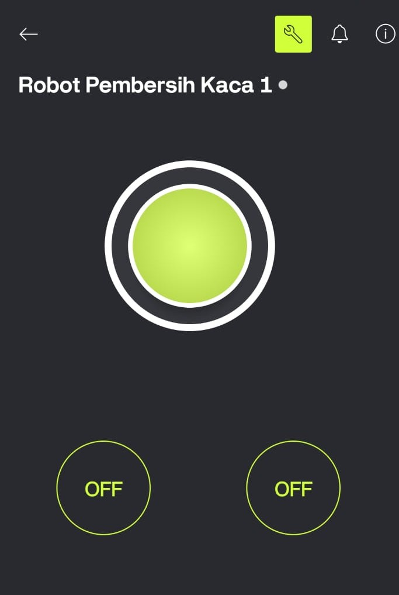

# 🤖 Robot Pembersih Kaca Berbasis Blynk

### 🌐 Smart Window Cleaning Robot with IoT Control

📌 **TIM PBL (2) – AKSIKALOKA**
📁 Repository:
🔗 [https://github.com/Rivetchan/Robot-Pembersih-Kaca-Berbasis-Blynk](https://github.com/Rivetchan/Robot-Pembersih-Kaca-Berbasis-Blynk)

---

  

## 📖 Deskripsi Proyek

**Robot Pembersih Kaca Berbasis Blynk** adalah sebuah robot pintar yang dirancang untuk membersihkan permukaan kaca secara **otomatis dan jarak jauh** menggunakan teknologi **Internet of Things (IoT)**.

Robot ini dikendalikan melalui aplikasi **Blynk** pada smartphone, sehingga pengguna dapat:

* Mengontrol pergerakan robot
* Mengaktifkan motor pembersih
* Mengatur sistem semprot air
* Memantau status robot secara real-time

Proyek ini dibuat sebagai bagian dari **Project Based Learning (PBL)** oleh **TIM AKSIKALOKA**.

---

## ✨ Fitur Utama

✅ Kontrol robot via **aplikasi Blynk (Android/iOS)**
✅ Koneksi **WiFi (ESP8266 / NodeMCU)**
✅ Mode **Manual Kontrol**
✅ Sistem pembersih kaca (motor + lap)
✅ Sistem semprot air
✅ Monitoring status robot

---

## 🧩 Komponen yang Digunakan

| No | Komponen                   | Fungsi                      |
| -- | -------------------------- | --------------------------- |
| 1  | ESP8266 / NodeMCU          | Mikrokontroler & IoT        |
| 2  | Motor DC                   | Menggerakkan robot          |
| 3  | Driver Motor (L298N/L293D) | Pengontrol motor            |
| 4  | Pompa air                  | Menyemprot cairan pembersih |
| 5  | Baterai                    | Sumber daya                 |
| 6  | Modul WiFi                 | Koneksi ke Blynk            |
| 7  | Smartphone + Blynk App     | Kontrol robot               |

---

## 📱 Tampilan Aplikasi Blynk

  

---

## 🎥 Demo Video (YouTube)

<video src="https://github.com/user-attachments/assets/df89376b-e38d-452d-aa1f-45bb53452fe2" width="80%" controls></video>

---

## 🔌 Cara Kerja Sistem

1. Robot dinyalakan menggunakan sumber daya baterai.
2. ESP8266 melakukan inisialisasi sistem dan mencoba terhubung ke jaringan WiFi yang telah dikonfigurasikan.
3. Setelah terhubung ke WiFi, ESP8266 terkoneksi dengan **Blynk Cloud Server** menggunakan *Auth Token*.
4. Aplikasi Blynk pada smartphone mengirimkan perintah kontrol (maju, mundur, semprot air, motor pembersih).
5. Mikrokontroler memproses data dari Blynk dan mengaktifkan output pin sesuai perintah.
6. Driver motor (L298N/L293D) mengatur arah dan kecepatan motor DC.
7. Pompa air aktif untuk menyemprot cairan pembersih ke permukaan kaca.
8. Robot bergerak dan membersihkan kaca secara bertahap.
9. Status sistem dapat dimonitor secara real-time melalui aplikasi Blynk.

---

## ⚙️ Instalasi & Penggunaan

### Persiapan Perangkat

* Pastikan seluruh komponen telah terpasang dengan benar sesuai rangkaian.
* Pastikan baterai dalam kondisi penuh.
* Gunakan jaringan WiFi yang stabil.

### Konfigurasi Blynk

* Buat template project di aplikasi Blynk.
* Atur widget tombol untuk:

  * Gerak motor (maju/mundur/kiri/kanan)
  * Motor pembersih
  * Pompa air
* Sesuaikan *Virtual Pin* dengan program di ESP8266.

### Pengoperasian Robot

1. Nyalakan robot.
2. Buka aplikasi Blynk di smartphone.
3. Pastikan status koneksi **ONLINE**.
4. Gunakan tombol kontrol untuk menjalankan robot.
5. Aktifkan pompa air dan motor pembersih sesuai kebutuhan.
6. Setelah selesai, matikan robot dan bersihkan lap pembersih.

---

## 🛡️ Keamanan & Perawatan

* Jangan gunakan robot pada kaca retak atau rapuh.
* Pastikan kabel dan konektor terlindung dari air.
* Bersihkan lap setelah pemakaian.
* Simpan robot di tempat kering.

---

## 📌 Catatan Pengembangan

Proyek ini masih dapat dikembangkan lebih lanjut dengan:

* Mode otomatis berbasis sensor
* Sensor jarak / sensor batas
* Kamera untuk monitoring visual
* Logging data ke cloud

---

## 👥 Tim Pengembang

**TIM PBL (2) GCR – Glass Cleaning Robot**

Robot Pembersih Kaca Berbasis Blynk dibuat sebagai bagian dari Project Based Learning (PBL) dengan tujuan mengimplementasikan teknologi IoT pada sistem robotika.
